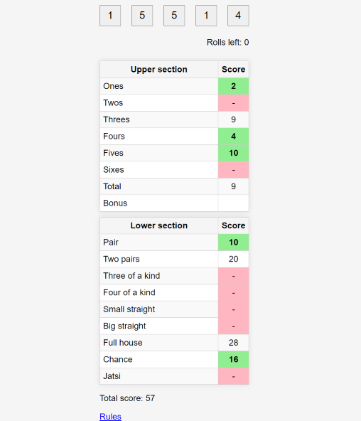

# Noppapeli

Noppapeli is a [Yatzy](https://en.wikipedia.org/wiki/Yatzy) dice game clone built in JavaScript, HTML and CSS.

Play the game at https://noppapeli.ollimyyrylainen.fi.

You can also play the game locally by cloning or downloading the project files and opening the ```index.html``` file in a web browser.

